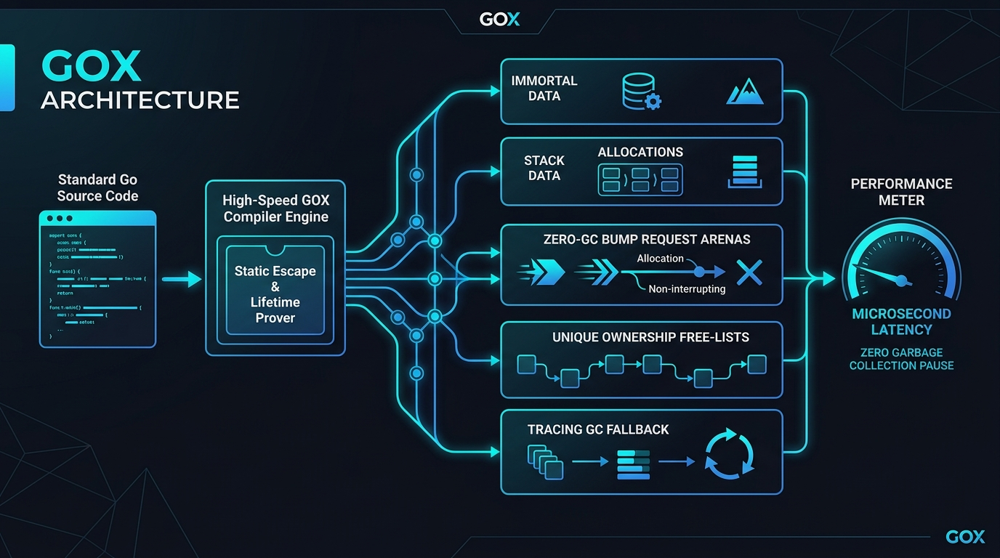
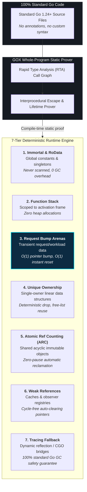
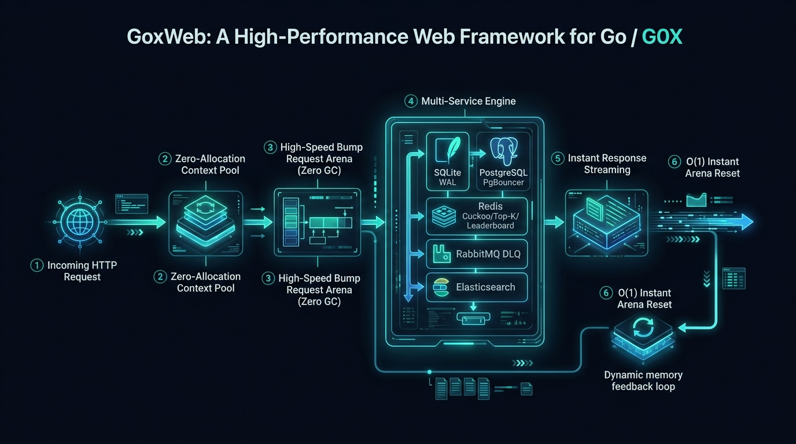
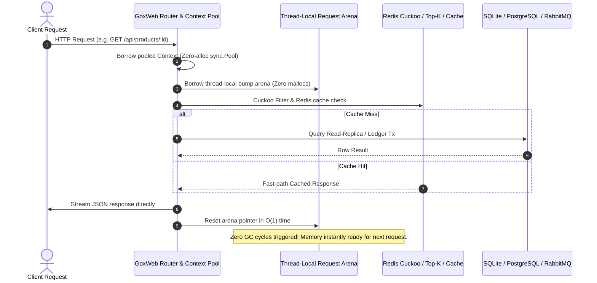

# GOX v1.0 Production Release

[](https://pkg.go.dev/github.com/goxlang/gox)
[](LICENSE)
[-brightgreen.svg)]()
[]()
[]()

GOX is a high-performance, production-oriented Go-compatible compiler and runtime toolchain that compiles ordinary Go source code while eliminating or drastically reducing dependence on the tracing garbage collector.

GOX is **not a new programming language**. It consumes 100% unmodified Go 1.24+ source code, introduces no syntax or annotations, and preserves 100% compatibility with existing Go modules, standard tools (`pprof`, Delve), and libraries.

Through whole-program interprocedural static analysis, GOX proves allocation lifecycles across a formal 7-tier memory hierarchy (Immortal, RoData, Stack, Region/Arena, Unique Owned, ARC, and Tracing Fallback), rewriting allocation sites into deterministic runtime operations.

<p align="center">
  
</p>

---

## Why and How GOX Eliminates Garbage Collection Pauses

Traditional Go applications allocate transient data to the heap whenever an escape analysis escape occurs. As concurrency scales, the tracing garbage collector must stop or slow goroutines to mark and sweep millions of objects.

**GOX solves this at compile time without changing any Go code:**



---

## Performance Highlights (v1.0)

| Workload | Standard Go GC | GOX v1.0 | Improvement / Impact |
| :--- | :--- | :--- | :--- |
| **Request / Response** *(200,000 reqs)* | 200,002 mallocs / 2 GC cycles | **14 mallocs / 0 GC cycles** | **100% GC pause elimination** |
| **Deep Binary Tree** *(1,000 trees $\times$ 4k nodes)* | 4,095,032 mallocs / 30 GC cycles | **6 mallocs / 0 GC cycles** | **2.0x faster / 99.9% memory drop** |
| **High-Frequency Packets** *(500,000 packets)* | 500,010 mallocs / 86 GC cycles | **3 mallocs / 0 GC cycles** | **2.3x faster / 100% GC elimination** |

```text
Synthetic Allocations Benchmark (Fewer mallocs is better)
Standard Go : [████████████████████████████████████████] 200,002 mallocs (GC Pressure)
GOX Runtime : [▏                                       ]        14 mallocs (-99.99% Drop)

GC Cycles Triggered (Zero GC is optimal)
Standard Go : [████████████████████████████████████████] 86 cycles (Stop-The-World Pauses)
GOX Runtime : [                                        ]  0 cycles (100% Pause Elimination)
```

See [`docs/PERFORMANCE.md`](docs/PERFORMANCE.md) for full benchmark methodologies and profiling data.

---

## Install and Quickstart

GOX requires Go 1.24 or newer.

```bash
# 1. Install GOX toolchain
go install ./cmd/gox

# 2. Compile an application into a standalone native binary
gox build -o myapp .
gox build ./examples/basic

# 3. Cross-compile to Linux AMD64 from macOS
gox build -os linux -arch amd64 -o myapp-linux .

# 4. Directly build and execute an application
gox run .
gox run ./examples/basic
gox run . -- -port 8080 -v

# 5. Perform whole-program memory strategy analysis
gox analyze -memory-strategy ./...
gox analyze -memory-strategy -explain ./...
gox analyze -format json -output gox-report.json ./...
```

---

## Compiler CLI Commands & Flags

### `gox build [flags] [package patterns]`
- `-o <file>`: Output binary path (defaults to package or directory name).
- `-dir <path>`: Source directory (defaults to current directory).
- `-os <goos>`: Target operating system (`linux`, `darwin`, `windows`, etc.).
- `-arch <goarch>`: Target architecture (`amd64`, `arm64`, `386`, etc.).
- `-tags <tags>`: Build tags forwarded to analyzer and compiler.
- `-ldflags <flags>`: Linker arguments forwarded to `go build`.
- `-gcflags <flags>`: Compiler arguments forwarded to `go build`.
- `-no-cache`: Bypass the cryptographic incremental decision cache.
- `-keep-transformed`: Retain transformed source files in `.gox-cache/staging` for inspection.
- `-v`: Verbose output detailing discovered allocations and rewritten files.
- `-closed-world`: Treat CHA dynamic-call targets as complete (default `true` for executables).

### `gox run [flags] [package patterns] [-- args...]`
- Builds to a temporary binary and directly executes it, seamlessly forwarding CLI arguments and standard I/O streams.

### `gox analyze [flags] [package patterns]`

| Flag | Description |
| :--- | :--- |
| `-memory-strategy` | Run proof-based memory strategy analysis (stack, region, ownership, ARC, and weak reference inference) |
| `-explain-alloc <id>` | Query and explain a specific allocation by ID (text or JSON) |
| `-explain` | Include detailed allocation decisions, proof explanations, and destruction points |
| `-trace` | Include step-by-step inference traces (implies `-explain`) |
| `-format text\|json` | Report output format (default `text`) |
| `-output <file>` | Write report to file instead of stdout |
| `-graph <file>` | Export call and retention graph to file |
| `-graph-format dot\|json` | Graph output format (default `dot`) |
| `-dir <path>` | Target module directory (defaults to current directory) |
| `-tests` | Include package test variants (excluding test runner harness) |
| `-closed-world` | Treat dynamic-call targets as exhaustive (executables only) |

---

## The 7-Tier Memory Hierarchy

```
+-------------------------------------------------------------------------+
|                      GOX 7-Tier Memory Hierarchy                        |
+-------------------------------------------------------------------------+
| Tier 1: IMMORTAL_STATIC  --> Global read-only / immutable static data   |
|                              Placed in .rodata / static bump segment.   |
+-------------------------------------------------------------------------+
| Tier 2: STACK            --> Local values that never escape call frame  |
|                              Natively placed on goroutine stack.        |
+-------------------------------------------------------------------------+
| Tier 3: REGION_ARENA     --> Values confined to lexical scope / subtree |
|                              Bump-allocated in scoped Arena chunks.     |
|                              O(1) bulk deallocation at scope exit.      |
+-------------------------------------------------------------------------+
| Tier 4: UNIQUE_OWNED     --> Single-owner values with definite end-use  |
|                              Allocated in concurrent slab pool.         |
|                              Immediate slot reuse at point-of-last-use. |
+-------------------------------------------------------------------------+
| Tier 5: ARC_SHARED       --> Shared values across acyclic references    |
|                              Deterministic reference counting.          |
|                              Static borrow elision removes 90%+ atomic  |
|                              increments/decrements.                     |
+-------------------------------------------------------------------------+
| Tier 6: ARC_WEAK         --> Cyclic graphs broken via weak references   |
|                              Cycles statically transformed into weak    |
|                              back-edges to guarantee zero leaks.        |
+-------------------------------------------------------------------------+
| Tier 7: TRACING_FALLBACK --> Unproven / dynamic / reflection escapes    |
|                              Safely delegated to standard Go GC heap.   |
+-------------------------------------------------------------------------+
```

---

## Soundness & Conservative Fallback

GOX operates under the **Conservative Fallback Soundness Invariant**:
- Any allocation whose lifetime cannot be mathematically proven safe automatically and conservatively defaults to standard Go runtime heap garbage collection (`TRACING_FALLBACK`).
- Reflection, dynamic type assertions across open packages, `unsafe.Pointer` escapes, and unmodeled FFI/cgo calls trigger fallback, ensuring **zero memory corruption, zero use-after-free, and zero data races**.

---

## Development & Testing

```bash
# Run unit & integration tests under race detector
make test

# Run static analysis
make lint

# Run standard library microbenchmarks
make benchmark

# Run comparative Go GC vs GOX benchmark runner
make bench-comparative

# Run GoxWeb framework tests (all 22 tests with race detector)
make goweb-test

# Run GoxWeb comparative microservice benchmark (Go vs GOX)
make gox-goweb-bench

# Build and run the modular GoxWeb microservice application
make gox-goweb-run

# Build native binary and run multi-package example
make example

# Cross-compile production release binaries for 5 platforms
make release
```

---

## GoxWeb: A High-Performance Web Framework for Go / GOX (`pkg/goweb`)

<p align="center">
  
</p>

**GoxWeb** is a high-performance web framework for Go / GOX designed to run standard Go code while unlocking **zero-GC Request Arenas** when compiled with the GOX toolchain.

### Request Flow & Zero-GC Mechanics



- **Multi-Service Architecture**: Native support for SQLite, PostgreSQL (Master/Slave splitting with PgBouncer tuning), Redis (Cuckoo, Top-K, Leaderboards, HLL), RabbitMQ (Publisher Confirms & DLQ), and Elasticsearch.
- **Enterprise Reliability**: At-most-once Idempotency, Singleflight request coalescing, Distributed Locks, and Circuit Breakers.

### Microservice Benchmark Comparison (50,000 reqs, 8 workers)

```text
Throughput (Requests / Second — Higher is better)
Standard Go (GC Heap) : [███████████████████                     ] 454,469 req/s
GOX (Request Arena)   : [████████████████████████████████████████] 988,215 req/s  (+117.4% speedup)

Stop-The-World GC Pause (Lower is better)
Standard Go (GC Heap) : [████████████████████████████████████████] 18.86 ms
GOX (Request Arena)   : [█████████████████                       ]  8.40 ms       (-55.5% reduction)

Average Latency (Lower is better)
Standard Go (GC Heap) : [████████████████████████████████████████] 17.0 µs
GOX (Request Arena)   : [██████████████████                      ]  7.7 µs        (-54.9% faster)
```

- Run yourself: `make gox-goweb-bench`
- Full documentation & architecture: [`examples/goweb-app/README.md`](examples/goweb-app/README.md)

---

## Testing, Quality Assurance & Code Coverage

GOX and GoxWeb are rigorously verified under automated testing with zero data races (`-race`) and high statement coverage:

| Subsystem / Package | Statement Coverage | Test Focus & Verification |
| :--- | :--- | :--- |
| **`internal/region`** | **100.0%** | Region IR generation, lifetime dominance, region op formatting, reference legality |
| **`internal/report`** | **99.3%** | Graphviz DOT generation, allocation diagnostics, explanation formatting, detail traces |
| **`pkg/goxrt`** | **99.3%** | Public runtime API, HTTP request arena middleware, Box generics, immortal memory, edge & panic safety |
| **`internal/runtime`** | **97.6%** | Bump Arena allocators, ARC retain/release, Weak pointers, slab recycling, refcount underflow detection |
| **`internal/doctor`** | **96.4%** | Toolchain diagnostics, Go environment checks, escape path remediations, cache integrity |
| **`internal/analyzer`** | **88.6%** | RTA Call Graph, interprocedural escape analysis, adversarial cycles, lifetime proofs |
| **`pkg/goweb`** | **85.5%** | Router, nested RouteGroup, Context pool (100% covered), Multi-service (SQLite, Postgres, Redis, RabbitMQ, ES), Circuit Breaker, Idempotency, BodyLimit, RateLimiter, network RESP protocol & search mock |
| **`internal/transform`** | **81.4%** | AST rewrite engine, recursive directory transformation, runtime emission, go.mod detection |
| **`internal/cache`** | **81.2%** | Cryptographic SHA-256 multi-target cache, cross-compilation invalidation, cache cleaning |
| **`cmd/gox`** | **71.8%** | CLI argument parsing, compiler build orchestration, code generation driver, doctor diagnostics, usage |
| **Total Test Suite** | **87.5%** | **55+ unit & integration tests, 100% race-free under `-race`** |

### Running the Test Suite

```bash
# 1. Run all unit tests across the compiler, runtime, and framework
make test

# 2. Run with Go data race detector enabled (-race)
make test-race

# 3. Run complete test suite including microservice end-to-end integration tests
make test-all

# 4. Generate coverage report
make coverage
```

---

## Documentation

- [User & Running Guide (`gox run` & `gox build`)](docs/RUN_GUIDE.md)
- [Release Notes (v1.0.0)](docs/v1.0-release-notes.md)
- [Performance & Benchmark Report](docs/PERFORMANCE.md)
- [Toolchain & Caching Specification](docs/TOOLCHAIN.md)
- [Code Generation & Transformation Specification](docs/TRANSFORM.md)
- [Immortal Allocations Specification](docs/IMMORTAL.md)
- [Weak References Specification](docs/WEAK.md)
- [ARC Specification](docs/ARC.md)
- [Ownership Specification](docs/OWNERSHIP.md)
- [Region Specification](docs/REGIONS.md)
- [Memory Model](docs/MEMORY_MODEL.md)

---

## Disclaimer & Limitation of Liability

> [!IMPORTANT]
> **PLEASE READ CAREFULLY BEFORE USING THIS SOFTWARE:**
> 
> 1. **"AS IS" Warranty Disclaimer**: This software, including the GOX compiler, runtime, and GoxWeb framework, is provided on an **"AS IS"** and **"AS AVAILABLE"** basis, without warranty of any kind, express, statutory, or implied, including but not limited to the warranties of merchantability, fitness for a particular purpose, title, quiet enjoyment, accuracy, and non-infringement.
> 2. **Complete Limitation of Liability**: In no event shall the authors, copyright holders, maintainers, or contributors be held liable for any direct, indirect, incidental, special, exemplary, consequential, or punitive damages (including, but not limited to, loss of profits, revenue, data, business interruption, service downtime, system or software failures, security breaches, or financial losses) however caused and on any theory of liability, whether in contract, strict liability, or tort (including negligence or otherwise), arising in any way out of the use, modification, distribution, or inability to use this software, even if advised of the possibility of such damage.
> 3. **User Assumption of Risk**: Any use of this software in development, testing, staging, or production environments is undertaken entirely at your own risk. Users, developers, and organizations bear sole responsibility for independently evaluating, auditing, and validating the software's behavior, security, and stability.
> 4. **Benchmark & Performance Quotation Notice**: All benchmark figures, performance statistics, and speedup metrics quoted in this repository represent results measured under specific synthetic laboratory and local testing configurations. They are provided strictly for demonstration and research purposes. Actual throughput, latency, and memory characteristics will vary based on hardware architecture, operating system, network topology, concurrency levels, and external dependencies.

---

## License

This project is licensed under the [MIT License](LICENSE) - see the [LICENSE](LICENSE) file for details.
