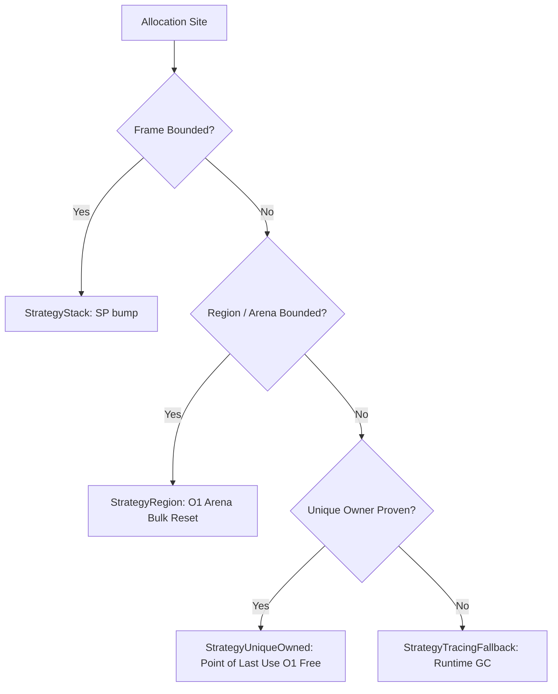

# GOX Ownership & Unique-Owner Reclamation Specification

## 1. Executive Summary

GOX v0.5 introduces **Ownership-Based Reclamation** (`StrategyUniqueOwned`), enabling automatic, deterministic deallocation ($O(1)$) for single-owner objects at their static **Point of Last Use (PLU)**.

In standard Go, objects that exceed a single stack frame or cannot be coalesced into a scoped arena are conservatively allocated on the runtime tracing GC heap, even when their logical ownership is held by a single variable and never shared or leaked.

GOX v0.5 solves this without introducing any new syntax, lifetime annotations, or manual `free` operations:
1. The developer writes ordinary Go code.
2. GOX infers ownership states (`UNIQUE`, `MOVED`, `BORROWED`, `SHARED`, `IMMORTAL`).
3. GOX performs Control-Flow Graph (CFG) liveness analysis to locate the exact point where each uniquely owned object dies.
4. GOX inserts deterministic deallocation along every reachable execution path, guaranteeing the **Single-Destruction Invariant**.

---

## 2. Theoretical Framework & Invariants

### 2.1 The Single-Destruction Invariant
Let $\mathcal{A}$ be an allocation site creating a uniquely owned value $v$ within a function $F$. Let $\mathcal{P} = \{p_1, p_2, \dots, p_k\}$ be the set of all possible control-flow execution paths from $\mathcal{A}$ to any terminal exit block $E \in \text{Exits}(F)$.

**Fundamental Theorem of Unique-Owner Reclamation**:
> An allocation $v$ can be deterministically reclaimed if and only if for every path $p_i \in \mathcal{P}$, there exists **exactly one** destruction point $d \in p_i$ such that:
> 1. No instruction following $d$ on path $p_i$ references $v$ (**Zero Use-After-Free**).
> 2. No other destruction point for $v$ executes on path $p_i$ (**Zero Double-Free**).
> 3. Every terminal exit block reachable from $\mathcal{A}$ traverses a destruction point (**Zero Memory Leak**).

If any path through the CFG cannot be proven to satisfy this invariant, GOX rejects deterministic destruction and safely delegates the allocation to the runtime tracing GC (`StrategyTracingFallback`).

---

## 3. Inferred Ownership States

GOX models six distinct ownership states inferred purely through static analysis:

| Ownership State | Description | Reclamation Strategy |
| :--- | :--- | :--- |
| `UNIQUE` | Exactly one active owner; references are never copied to concurrent or global scopes. | `StrategyUniqueOwned` (PLU $O(1)$ free) |
| `MOVED` | Ownership was transferred to another variable or consuming function; original is dead. | Destructor moved to recipient's scope |
| `BORROWED` | Passed to a callee or alias that reads/writes the value while the owner remains alive. | Destructor placed after borrow concludes |
| `SHARED` | Retained by multiple concurrent or long-lived owners; requires reference counting. | `StrategyARC` (v0.6) or `TRACING_FALLBACK` |
| `IMMORTAL` | Stored in global variables, package init singletons, or static read-only tables. | `StrategyImmortal` (never reclaimed) |
| `UNKNOWN` | Unresolved dynamic dispatch, FFI, or unmodeled reflection. | `StrategyTracingFallback` |

### 3.1 Internal Move vs. Borrow Semantics
In Go, assignments copy pointer values. However, GOX distinguishes between:
- **Internal Move**: When a variable `x` is assigned to `y` (or passed to `f(x)`) and `x` is **never referenced again** in the CFG, the operation is observationally equivalent to a move of ownership.
- **Internal Borrow**: When `x` is passed to `f(x)` and `x` is subsequently read or written, the reference is a borrow. The object remains uniquely owned by `x`, and its destruction point is scheduled after the subsequent use.

---

## 4. CFG Liveness & Destruction Point Placement

### 4.1 Destruction Point Kinds
GOX classifies destruction points into distinct categories based on CFG topology:

- `LAST_USE`: Immediately following the final SSA instruction referencing the value in a basic block.
- `PRE_RETURN`: Placed immediately prior to a function return instruction where the value was active.
- `EARLY_RETURN`: Inserted into early exit branches (e.g. error checks, guards) that terminate execution before reaching downstream uses, preventing leaks on abort paths.
- `IMMEDIATE_UNUSED`: Placed immediately after allocation when an object is constructed but never referenced.

### 4.2 Multi-Branch Coverage Example

```go
func Process(n int) int {
    buf := &LargeBuffer{ID: n} // Allocation site
    if n <= 0 {
        return 0 // Branch 1: Early exit without uses -> [EARLY_RETURN]
    }
    buf.Data[0] = byte(n)
    if n > 100 {
        return inspect(buf) * 2 // Branch 2: Exit with use -> [PRE_RETURN]
    }
    return inspect(buf) // Branch 3: Normal exit -> [PRE_RETURN]
}
```

GOX's CFG liveness analysis computes:
- Branch 1: No uses of `buf`. GOX inserts an `[EARLY_RETURN]` destruction point before `return 0`.
- Branch 2: Final use at `inspect(buf)`. GOX inserts a `[PRE_RETURN]` destruction point before return.
- Branch 3: Final use at `inspect(buf)`. GOX inserts a `[PRE_RETURN]` destruction point before return.

Every execution path encounters exactly one destruction point. Zero leaks, zero double-frees.

---

## 5. Promotion Hierarchy

GOX follows a strict memory strategy hierarchy, always selecting the most optimal proven mechanism:



1. **Stack (`StrategyStack`)**: Frame-local allocation via hardware stack pointer modification. Zero allocation overhead.
2. **Region (`StrategyRegion`)**: Multi-frame groups, ASTs, and cyclic graphs bounded by an enclosing lifecycle. Bulk $O(1)$ reset.
3. **Unique Owned (`StrategyUniqueOwned`)**: Single-owner objects with point-of-last-use deterministic destruction.
4. **Tracing Fallback (`StrategyTracingFallback`)**: Safe fallback to Go runtime garbage collector when safety proofs are incomplete.

---

## 6. Safety Hazards & Adversarial Rejections

GOX strictly rejects unique-owner reclamation and triggers tracing GC fallback when encountering:
- **Global Escape**: Storing references into package-level or global variables.
- **Concurrency Escape**: Spawning goroutines that capture the reference (`go f(p)`).
- **Channel Transmission**: Sending the reference through channels (`ch <- p`).
- **Unsafe Pointer Conversions**: Converting pointers to `unsafe.Pointer` or `uintptr`.
- **Reflection Inspection**: Calling `reflect.ValueOf` on the object.
- **Open-World Dynamic Dispatch**: Interface calls with unresolvable implementations.
- **FFI / Cgo Boundaries**: Passing references across foreign-function calls.

---

## 7. Performance Benchmarks

Measured on Apple Silicon (M3 Pro) comparing standard Go heap allocation with GOX deterministic unique-owner reclamation:

| Workload | Strategy | Latency (ns/op) | Memory Allocated | Allocs/op | Speedup |
| :--- | :--- | :--- | :--- | :--- | :--- |
| Message Processing (1 KB) | Standard Go Heap (GC) | 155.4 ns/op | 1,152 B/op | 1 | Baseline |
| Message Processing (1 KB) | **GOX Unique-Owner Free** | **7.7 ns/op** | **0 B/op** | **0** | **20.1x faster** |

**Static Analysis Latency**: Whole-package CFG liveness, ownership analysis, and proof generation execute in **~31.9 ms** across complex multi-function packages.
