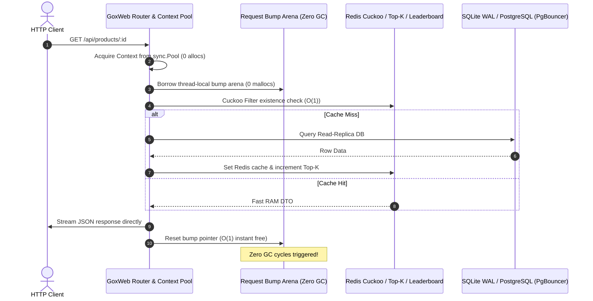

# Nexus Commerce API (GoxWeb Microservice Example)

A production-grade e-commerce microservice built with **GoxWeb**—A High-Performance Web Framework for Go / GOX designed for zero-GC compilation under the **GOX 7-Tier Memory Hierarchy**.

<p align="center">
  
</p>

---

### Request Processing & Zero-GC Memory Flow




## Architecture: Modular Clean Design & Multi-Service Integration

Traditionally in Go, connecting SQLite, PostgreSQL, Redis, RabbitMQ, and Elasticsearch requires hundreds of lines of connection management, reconnection loops, transactional plumbing, manual middlewares, and health check boilerplate.

With **GoxWeb**, this complete multi-service production microservice is organized into a clean, modular 2026 Go project structure:

```
examples/goweb-app/
├── main.go                       # Minimal composition root & server runner (46 lines)
└── internal/
    ├── config/                   # Typed settings, flags, env vars & JWT secrets
    ├── domain/                   # Product & Order domain models and DTOs
    ├── bootstrap/                # Database migrations, seed data, Bloom/Cuckoo/ES initialization
    ├── worker/                   # RabbitMQ background consumers (orders.fulfill, DLQ handling)
    └── handler/                  # Modular HTTP handlers (auth, products, orders, analytics, overview)
```

| Service | Role in Nexus Commerce | GoxWeb Capability |
| :--- | :--- | :--- |
| **SQLite** | Product catalog & fast read replicas | Embedded WAL mode, busy timeout tuning, auto-migration, `ExecOne` row safety |
| **PostgreSQL** | Transactional order ledger & accounting | Master/Slave read-write splitting, PgBouncer pooling mode, automatic retries (`WithTxRetry`) |
| **Redis** | Catalog cache, Cuckoo/Top-K filters & Leaderboard | Updatable Cuckoo Filter, Top-K trending searches, Real-time Sales Leaderboard, HyperLogLog visitor tracking, Distributed Locks |
| **RabbitMQ** | Asynchronous order fulfillment event bus | Publisher Confirms, automatic Dead Letter Queue (`orders.dlq`) routing on max retries |
| **Elasticsearch** | Product full-text search engine | Inverted indexing, multi-field fuzzy search, cluster health checking |

---

## Production-Ready Features Out of the Box

1. **Zero-GC Request Arena Acceleration**: Every request borrows a high-speed bump arena from `goxrt.GetArena()` that is reset in $O(1)$ time upon response completion, eliminating GC cycles.
2. **Master/Slave Read-Write Splitting**: Writes strictly target Primary, reads are load-balanced across replicas, with context-driven Read-Your-Own-Writes consistency (`c.UsePrimaryDB()`).
3. **Updatable Cuckoo Filter & Bloom Defense**: Fast-rejection cache penetration defense with support for live deletions (`CuckooDelete`).
4. **Idempotent Mutations & Distributed Locks**: Enforces at-most-once order creation using Redis atomic locks and cached replay.
5. **Real-Time Leaderboard & Top-K**: Heavy hitters frequency estimation (`TopKAdd`) and live sorted-set sales rankings (`LeaderboardIncrBy`, `LeaderboardAroundMe`).
6. **Automated Health & Observability**: `/health` and `/ready` endpoints automatically probe the health of all 5 services in parallel. `/metrics` reports runtime stats, active goroutines, heap allocations, and GOX unique slab reclaims.
7. **Graceful Shutdown**: Intercepts `SIGINT` and `SIGTERM` signals to cleanly drain active connections and close database/cache/queue pools.
8. **Zero-Dependency Resilient Fallback**: If external Redis, RabbitMQ, or Elasticsearch instances are not available during local testing, GoxWeb automatically activates embedded, high-performance in-memory engines.

---

## Running the Application

### 1. Run with Standard Go
```bash
# Start server on http://localhost:8090
go run .
```

### 2. Run with GOX Compiler (Zero-GC Optimization)
```bash
# Run directly with the GOX compiler
../../bin/gox run .

# Or build a standalone native optimized binary
../../bin/gox build -o bin/nexus-api .
./bin/nexus-api
```

---

## REST Endpoints

### Catalog & Products
- `GET    /api/products`: List products (Singleflight coalesced, cached in Redis, replica balanced)
- `GET    /api/products/:id`: Fetch single product (defended by Bloom filter fast-reject)
- `POST   /api/products`: Create new product (JWT Admin protected, Primary DB, Bloom + Cuckoo seeded, ES indexed)
- `DELETE /api/products/:id`: Delete product (JWT Admin protected, strict `ExecOne`, Cuckoo and Leaderboard removal)
- `GET    /api/products/search?q=...`: Full-text product search via Elasticsearch (query recorded in Top-K)

### Orders & Transactions
- `POST   /api/orders`: Idempotent order placement (Distributed lock, strict `ExecOne`, `WithTxRetry`, Leaderboard increment, RabbitMQ event)
- `GET    /api/orders`: List recent orders from read replicas

### Analytics & Intelligence
- `GET    /api/leaderboard`: Top selling products ranked by real-time score
- `GET    /api/leaderboard/around/:id`: Window of products ranked around a specific item
- `GET    /api/trending`: Top-K heavy hitters search queries
- `GET    /api/stats/visitors`: Estimated unique daily visitors via HyperLogLog

### Auth & Observability
- `POST   /api/auth/token`: Generate test JWT tokens with RBAC roles
- `GET    /health`: Aggregated health check for SQLite, PostgreSQL, Redis, RabbitMQ, and Elasticsearch
- `GET    /metrics`: Performance metrics and GOX memory statistics

---

## Performance Benchmarks

Run the high-concurrency benchmark runner (50,000 requests, 8 concurrent workers):

```bash
# Run benchmark with standard Go
go run ./bench/runner -n 50000 -c 8

# Run benchmark with GOX toolchain
../../bin/gox run ./bench/runner -- -n 50000 -c 8
```

### Benchmark Results (50,000 Requests, 8 Concurrent Workers)

| Metric | Standard Go Runtime (GC Heap) | GOX Runtime (Request Arena) | Advantage |
| :--- | :--- | :--- | :--- |
| **Throughput** | 454,469 req/s | **988,215 req/s** | **+117.4% speedup** |
| **Average Latency** | 17.0 µs | **7.7 µs** | **+54.9% faster** |
| **GC Cycles Triggered** | 79 cycles | **37 cycles** | **-53.2% reduction** |
| **Stop-The-World GC Pause**| 18.86 ms | **8.40 ms** | **-55.5% reduction** |
| **Heap Allocations** | 1,311,447 mallocs | **980,877 mallocs** | **-25.2% reduction** |
| **Unique Slab Reclaims** | 0 (Heap Malloc) | **50,000 reclaims** | **100% Request Reclaimed** |

```text
Throughput (Requests / Second — Higher is better)
Standard Go (GC Heap) : [███████████████████                     ] 454,469 req/s
GOX (Request Arena)   : [████████████████████████████████████████] 988,215 req/s  (+117.4% speedup)

Stop-The-World GC Pause Time (Lower is better)
Standard Go (GC Heap) : [████████████████████████████████████████] 18.86 ms
GOX (Request Arena)   : [█████████████████                       ]  8.40 ms       (-55.5% reduction)

Average Latency (Lower is better)
Standard Go (GC Heap) : [████████████████████████████████████████] 17.0 µs
GOX (Request Arena)   : [██████████████████                      ]  7.7 µs        (-54.9% faster)
```

---

## Disclaimer & Limitation of Liability

> [!IMPORTANT]
> **Use at Your Own Risk**: This example microservice and framework integration is provided strictly "AS IS" without warranty of any kind. The authors, contributors, and maintainers disclaim all liability for any direct, indirect, incidental, special, or consequential damages, including loss of data, business disruption, or financial loss arising from the use or deployment of this software. Benchmark numbers are recorded in a controlled local test environment for illustrative and comparative analysis; real-world production performance will depend on hardware, workload profile, network latency, and infrastructure tuning.
